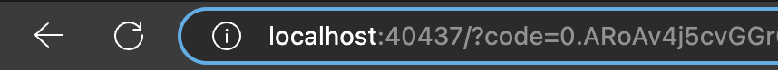
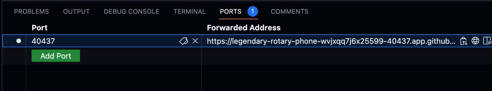
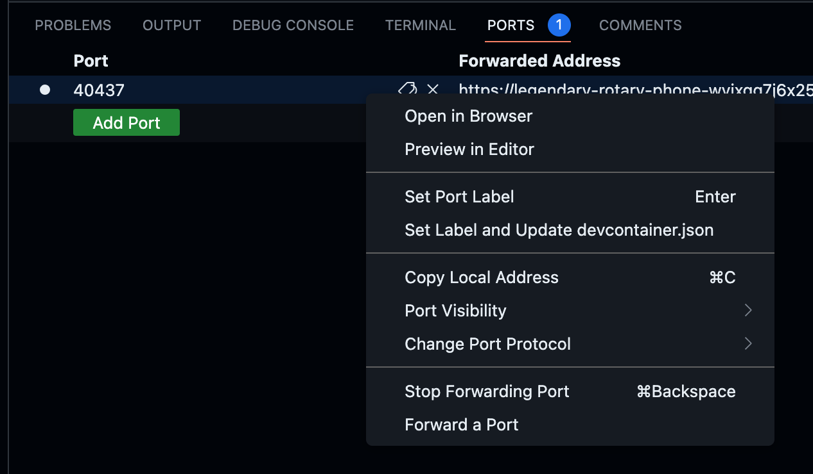
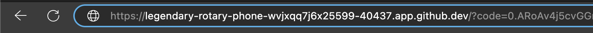
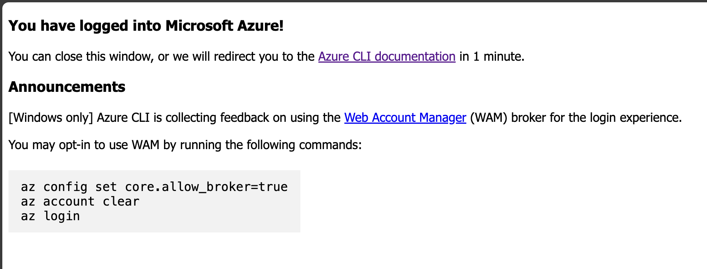

# Azure CLI login

Depending on your choice of running the walkthrough, you will need to authenticate to Azure using the Azure CLI. The following sections describe how to authenticate to Azure using the Azure CLI for each option.

## Devcontainer

```bash
az login
```

## Codespace using VSCode

```bash
az login
```

## Codespace in browser

Azure CLI doesn't know when it's running on Codespaces, and after authenticating the user, it will try to use localhost to return a response which will fail to resolve. As a workaround, we can use port forwarding to redirect the call to the Codespaces container by following these steps:

After executing `az login` and receiving the page not found error, note the port number (localhost:<port-number>) in the URL address.



Go back to the Codespaces browser tab and click on the `Ports` tab. The Codespaces editor creates the port forwarding automatically. There should be an entry in the port list with the same port number as the one you saw in the URL address.



Copy the local address from that record. You can right click on the record and choose `copy local address`.



Go back to the browser tab with the not found error (where you saw the localhost:XXXX) and replace the localhost:XXX portion of the URL with the value you copied from the ports tab in the codespace. It should now look like this:



Press enter, this should redirect the call to the Codespaces container and the Azure CLI will now receive the response from the `az login` command. The page should change to something like:



Finally, go back to Codespaces terminal tab. The Azure CLI should now be logged in.
