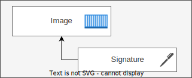
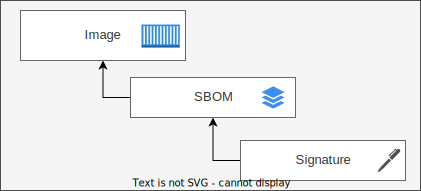
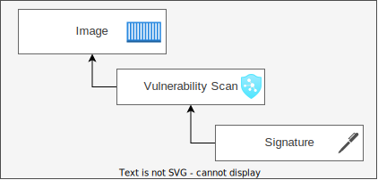

# Deploy workloads

Now that the chosen pipeline has run, [the images and attached artifacts have been reviewed](view-artifacts.md) and [Gatekeeper and Ratify have been configured to enforce policy in AKS](policy-configuration.md), it is time to see it all in action.

To ensure all of the previously set environment variables are set for the current session they must be imported.

```bash
. ./config/sssc.env
```

## Deploy unsigned workload also lacking security artifacts

Deploy the POI workload. This deployment should fail as the image lacks signatures, SBOMs, and vulnerability scan results.

```bash
fail_img=$ACR_LOGIN_SERVER/poi:v1
kubectl run poi --image=$fail_img
```

Failed output shown in the terminal should resemble:

```txt
Error from server (Forbidden): admission webhook "validation.gatekeeper.sh" denied the request: 
[sbom-validation] Subject sssczmskwoacr.azurecr.io/poi@sha256:ef027856e50f0f15e7bddb7d2232f28a8afad19c71413f9b5beefdbe095c3d57 failed as no SBOMs were found
[trivy-validation] Subject sssczmskwoacr.azurecr.io/poi@sha256:ef027856e50f0f15e7bddb7d2232f28a8afad19c71413f9b5beefdbe095c3d57 failed as no Trivy scan results were found
[signature-issuer-validation] Subject sssczmskwoacr.azurecr.io/poi@sha256:ef027856e50f0f15e7bddb7d2232f28a8afad19c71413f9b5beefdbe095c3d57 failed signature validation
```

Use `kubectl logs` to get Ratify logs for the POI deployment

```bash
kubectl logs -l app.kubernetes.io/name=ratify --namespace gatekeeper-system
```

The output should resemble:

> [!NOTE]
> The highlighted message explains that verification failed because the image lacks attached artifacts, also known as _referrers_.

```diff
time="2023-08-08T17:38:51Z" level=info msg="Resolve of the image completed successfully the digest is sha256:7393f69227364c91cc53d846a67794a50fdb9bed47274dec6f767cb4ec769c4b"
{
    "isSuccess": false,
    "verifierReports":
    [{
        "subject": "ssscf728s8acr.azurecr.io/poi@sha256:7393f69227364c91cc53d846a67794a50fdb9bed47274dec6f767cb4ec769c4b",
        "isSuccess": false,
-       "message": "verification failed: no referrers found for this artifact"
    }]
}
```

## Deploy signed workload with required signed security artifacts

Deploy the Trips workload. This deployment should succeed as the image has signatures, SBOMs, and vulnerability scan results.

```bash
success_img=$ACR_LOGIN_SERVER/trips:v1
kubectl run trips --image=$success_img
```

Successful deployment output shown in the terminal should resemble:

```txt
pod/trips created
```

Use `kubectl logs` to get Ratify logs for the Trips deployment

```bash
kubectl logs -l app.kubernetes.io/name=ratify --namespace gatekeeper-system
```

The output should resemble:

> [!NOTE]
> A detailed breakdown of the important bits of this wall of text can be found [below](#log-breakdown)

```txt
time="2023-08-08T18:00:17Z" level=info msg="Resolve of the image completed successfully the digest is sha256:5cae60c8a03d85cee2b8b15dc15b8fd186d95f192752de4893c68398597023c8"
{
"isSuccess": true,
"verifierReports": [
    {
        "subject": "ssscf728s8acr.azurecr.io/trips@sha256:5cae60c8a03d85cee2b8b15dc15b8fd186d95f192752de4893c68398597023c8",
        "isSuccess": true,
        "name": "notaryv2",
        "message": "signature verification success",
        "extensions": {
            "Issuer": "CN=ca.example.com,OU=My Org,O=My Company,L=Redmond,ST=WA,C=US",
            "SN": "CN=pipeline.example.com,OU=My Org,O=My Company,L=Redmond,ST=WA,C=US"
        },
        "artifactType": "application/vnd.cncf.notary.signature"
    },
    {
        "subject": "ssscf728s8acr.azurecr.io/trips@sha256:5cae60c8a03d85cee2b8b15dc15b8fd186d95f192752de4893c68398597023c8",
        "isSuccess": true,
        "name": "sbom",
        "message": "SBOM verification success. The schema is good.",
        "extensions": {
            "created": "2023-08-08T16:13:16Z",
            "creators": [
            "Organization: trips",
            "Tool: Microsoft.SBOMTool-1.1.5"
            ],
            "licenseListVersion": ""
        },
        "nestedResults": [ {
            "subject": "ssscf728s8acr.azurecr.io/trips@sha256:abae2a449042af6032559b124236f1ac7f68445b2012b6c6442095f5f9b9672a",
            "isSuccess": true,
            "name": "notaryv2",
            "message": "signature verification success",
            "extensions": {
                "Issuer": "CN=ca.example.com,OU=My Org,O=My Company,L=Redmond,ST=WA,C=US",
                "SN": "CN=pipeline.example.com,OU=My Org,O=My Company,L=Redmond,ST=WA,C=US"
            },
            "artifactType": "application/vnd.cncf.notary.signature"
        } ],
        "artifactType": "application/org.example.sbom.v0"
    },
    {
        "subject": "ssscf728s8acr.azurecr.io/trips@sha256:5cae60c8a03d85cee2b8b15dc15b8fd186d95f192752de4893c68398597023c8",
        "isSuccess": true,
        "name": "schemavalidator",
        "message": "schema validation passed for configured media types",
        "nestedResults": [ {
            "subject": "ssscf728s8acr.azurecr.io/trips@sha256:0a381a77b1229b19e275b6d4f1b8774519c96d5dcdc770ab3d85d0a8b8770d70",
            "isSuccess": true,
            "name": "notaryv2",
            "message": "signature verification success",
            "extensions": {
                "Issuer": "CN=ca.example.com,OU=My Org,O=My Company,L=Redmond,ST=WA,C=US",
                "SN": "CN=pipeline.example.com,OU=My Org,O=My Company,L=Redmond,ST=WA,C=US"
            },
            "artifactType": "application/vnd.cncf.notary.signature"
        } ],
    "artifactType": "application/trivy+json"
    } ]
}
```

### Log breakdown

In the output above, the image deployed by tag resolved to `digest`. This should match the value of the ORAS output for Trips while validating the [artifact bundle](artifact-bundle-verification.md#trips) post-pipeline execution. The full body of the JSON response from Ratify is also output. Each item in `verifierReports` will be discussed below.

**Image signature**



The `verifierReports` item with `subject` matching the image digest, `name` being "notaryv2" and `artifactType` of `application/vnd.cncf.notary.signature` is for the image's signature. Of note, the [constraint enforcing images must be signed](../../policy/gatekeeper/signedimage/constraint-template.notation.yaml) validates that the value of `Issuer` in `extensions` matches the `subject` of the certificate authority (CA) created within [create_ca.sh](../../scripts/certs/create_ca.sh).

```diff
{
+   "subject": "ssscf728s8acr.azurecr.io/trips@sha256:5cae60c8a03d85cee2b8b15dc15b8fd186d95f192752de4893c68398597023c8",
    "isSuccess": true,
+   "name": "notaryv2",
    "message": "signature verification success",
    "extensions": {
+       "Issuer": "CN=ca.example.com,OU=My Org,O=My Company,L=Redmond,ST=WA,C=US",
        "SN": "CN=pipeline.example.com,OU=My Org,O=My Company,L=Redmond,ST=WA,C=US"
    },
+   "artifactType": "application/vnd.cncf.notary.signature"
}
```

**SBOM and its signature**



The `verifierReports` item with `subject` matching the image digest, `name` being "sbom" and `artifactType` of `application/org.example.sbom.v0` is for the image's SBOM.

In turn, it has a collection of `nestedResults` which includes a single item with `name` being "notaryv2" and `artifactType` of "application/vnd.cncf.notary.signature" for the SBOM's own signature. The `subject` of the nested result should match the digest of the artifact of type "application/org.example.sbom.v0" returned by ORAS when validating the [artifact bundle](artifact-bundle-verification.md#trips) post-pipeline execution. As was done for the image's signature, the [constraint enforcing images must have a signed and valid SPDX SBOM](../../policy/gatekeeper/signedsbom/constraint-template.spdx.notation.yaml) validates that the value of `Issuer` in `extensions` matches the `subject` of the certificate authority (CA).

```diff
 {
+   "subject": "ssscf728s8acr.azurecr.io/trips@sha256:5cae60c8a03d85cee2b8b15dc15b8fd186d95f192752de4893c68398597023c8",
    "isSuccess": true,
+   "name": "sbom",
    "message": "SBOM verification success. The schema is good.",
    "extensions": {
        "created": "2023-08-08T16:13:16Z",
        "creators": [
            "Organization: trips",
            "Tool: Microsoft.SBOMTool-1.1.5"
        ],
        "licenseListVersion": ""
    },
+    "nestedResults": [{
        "subject": "ssscf728s8acr.azurecr.io/trips@sha256:abae2a449042af6032559b124236f1ac7f68445b2012b6c6442095f5f9b9672a",
        "isSuccess": true,
-       "name": "notaryv2",
        "message": "signature verification success",
        "extensions": {
-           "Issuer": "CN=ca.example.com,OU=My Org,O=My Company,L=Redmond,ST=WA,C=US",
            "SN": "CN=pipeline.example.com,OU=My Org,O=My Company,L=Redmond,ST=WA,C=US"
        },
-       "artifactType": "application/vnd.cncf.notary.signature"
    }],
+   "artifactType": "application/org.example.sbom.v0"
}
```

**Vulnerability scan result and its signature**



The `verifierReports` item with `subject` matching the image digest, `name` being "schemavalidator" and `artifactType` of "application/trivy+json" is for the image's vulnerability scan result.

In turn, it has a collection of `nestedResults` which includes a single item with `name` being "notaryv2" and `artifactType` of "application/vnd.cncf.notary.signature" for the vulnerability scan results's own signature. The `subject` of the nested result should match the digest of the artifact of type `application/trivy+json` returned by ORAS when validating the [artifact bundle](artifact-bundle-verification.md#trips) post-pipeline execution. As was done for the image's signature, the [constraint enforcing images must have a signed and valid vulnerability scan result](../../policy/gatekeeper/signedvulnscanresult/constraint-template.trivy.notation.yaml) validates that the value of `Issuer` in `extensions` matches the `subject` of the certificate authority (CA).

```diff
{
+   "subject": "ssscf728s8acr.azurecr.io/trips@sha256:5cae60c8a03d85cee2b8b15dc15b8fd186d95f192752de4893c68398597023c8",
    "isSuccess": true,
+   "name": "schemavalidator",
    "message": "schema validation passed for configured media types",
+   "nestedResults": [ {
        "subject": "ssscf728s8acr.azurecr.io/trips@sha256:0a381a77b1229b19e275b6d4f1b8774519c96d5dcdc770ab3d85d0a8b8770d70",
        "isSuccess": true,
-       "name": "notaryv2",
        "message": "signature verification success",
        "extensions": {
-           "Issuer": "CN=ca.example.com,OU=My Org,O=My Company,L=Redmond,ST=WA,C=US",
            "SN": "CN=pipeline.example.com,OU=My Org,O=My Company,L=Redmond,ST=WA,C=US"
        },
-       "artifactType": "application/vnd.cncf.notary.signature"
    } ],
+   "artifactType": "application/trivy+json"
}
```

## Teardown

Proceed to teardown to clean up all resources created during the walkthrough.

<br/>

[](teardown.md)
